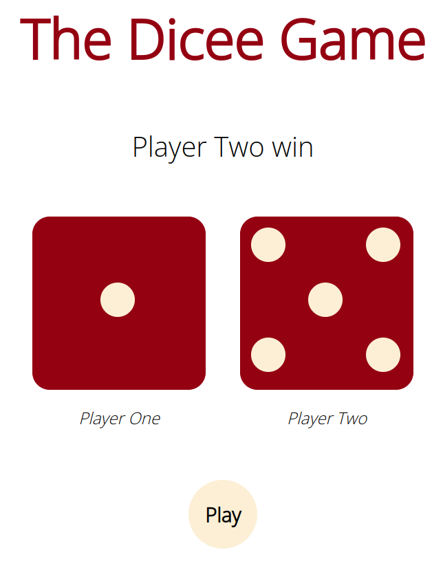

## The Dicee Game

The **Dicee Game** is a simple web site game written in *html*, *css*, *javascript*    
   
Try "The **Dicee Game**" [here](https://resole79.github.io/the-dicee-game/)     


###### It's a part of the **The Complete 2023 Web Development Bootcamp** challenge by Angela Yu. ######


#### Installation
To get started with the "The Dicee Game", follow these steps:

1. **Clone** the repository:

```sh
git clone https://github.com/resole79/the-dicee-game.git
```

2. **Run** the **index.html** file
    

#### *File Structure*

 - **index.html**
 - **css/css.css**
 - **js/js.js**


#### **Usage**


**How web site present**




## **Credit**

Author : Emilio Reforgiato (resole79)

##
<p align="right"><a href="https://www.linkedin.com/in/emilio-reforgiato/" target=”_blank” ></a></p>


